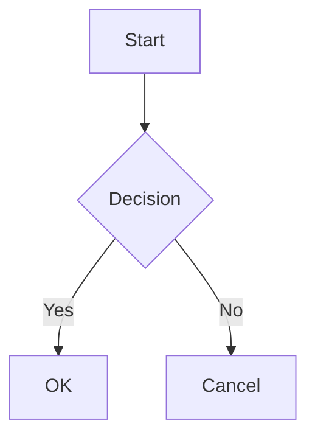
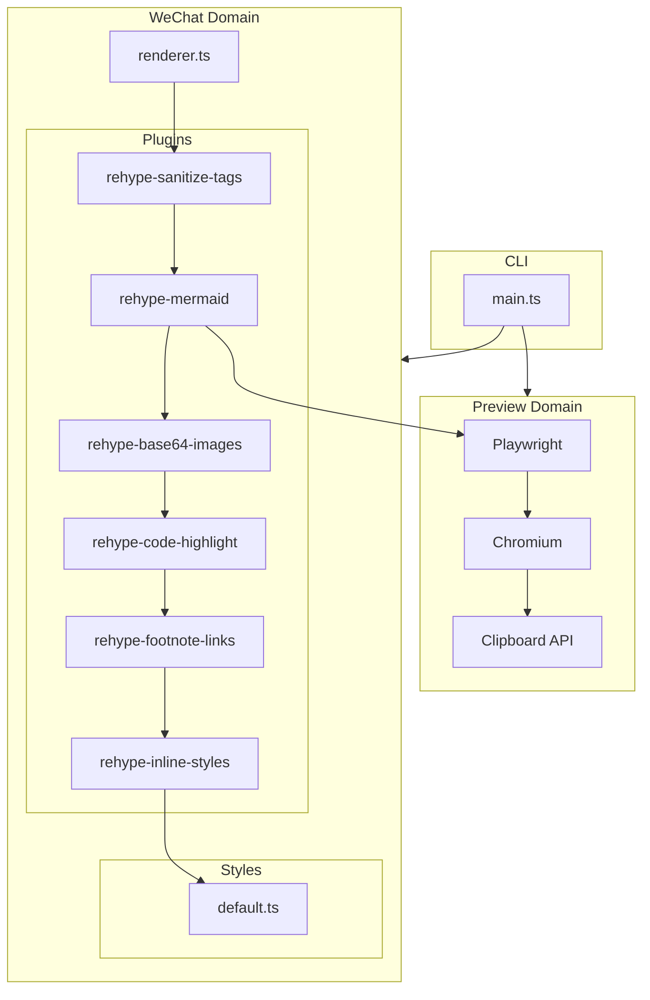

# Welcome to mdpress

This is a **bold** and *italic* paragraph with `inline code`.

## Code Block

```javascript
function greet(name) {
  const msg = `Hello, ${name}!`;
  return msg;
}
```

## Links

Visit [GitHub](https://github.com) for code hosting.

Check [Another Link](https://example.com) too.

Read this [WeChat Article](https://mp.weixin.qq.com/s/abc123).

## Lists

- Item one
- Item two
  - Nested item

1. First
2. Second

## Task List

- [x] Completed task
- [ ] Pending task

## Blockquote

> This is a quote with **emphasis**.

## Table

| Feature | Status |
|---------|--------|
| Sanitize | Done |
| Images | Done |

## Horizontal Rule

---

## Image


## Formatting

This has ~~strikethrough~~ text and <mark>highlighted</mark> text.

<div>This div should become a section.</div>

<script>alert('xss')</script>

## Mermaid Diagram



## Architecture Diagram


