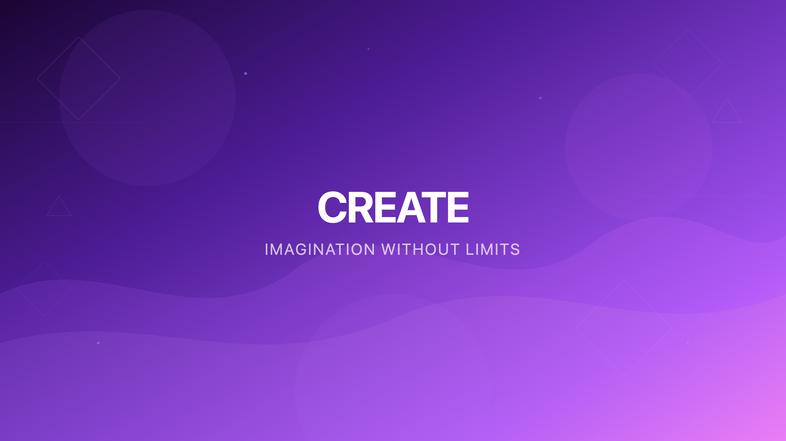
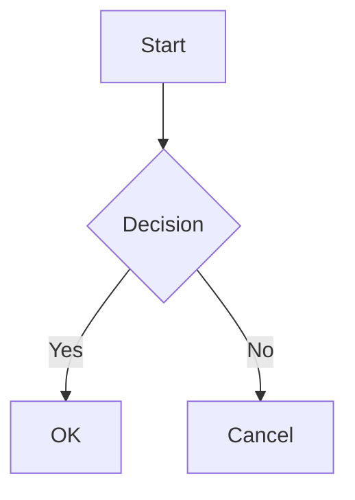
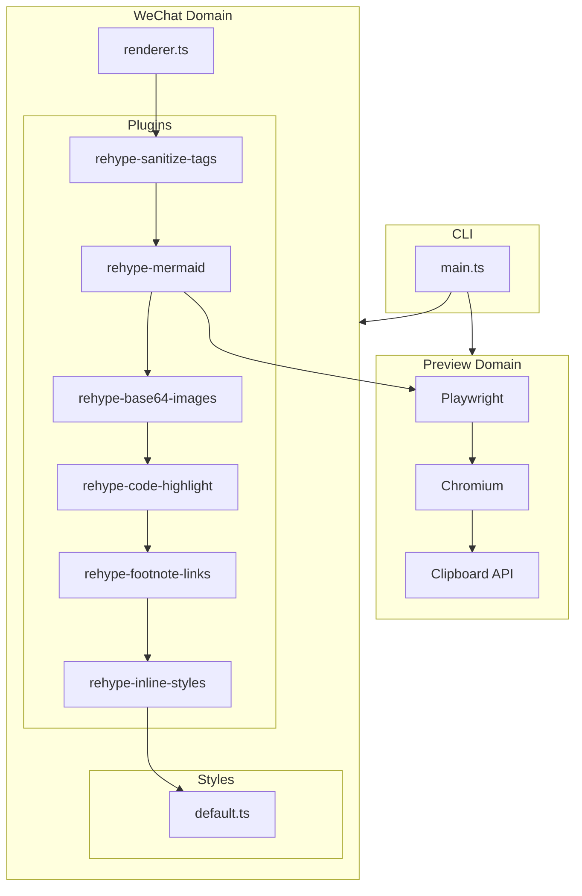

# Welcome to wxpress

This is a **bold** and *italic* paragraph with `inline code`.

## Code Block

```javascript
// A longer code block to demonstrate word-wrap behavior in WeChat editor
function createUserProfile(firstName, lastName, email, role = 'viewer', preferences = { theme: 'light', notifications: true, language: 'zh-CN' }) {
  const fullName = `${firstName} ${lastName}`;
  const profile = { id: crypto.randomUUID(), fullName, email, role, preferences, createdAt: new Date().toISOString() };
  console.log(`Created profile for ${fullName} <${email}> with role="${role}" and preferences=${JSON.stringify(preferences)}`);
  return profile;
}

const users = ['Alice', 'Bob', 'Charlie'].map((name, i) => createUserProfile(name, name.toLowerCase(), `${name.toLowerCase()}@example.com`, i === 0 ? 'admin' : 'viewer'));
```

## Links

Visit [GitHub](https://github.com) for code hosting.

Check [Another Link](https://example.com) too.

Read this [WeChat Article](https://mp.weixin.qq.com/s/V5lGAY95eQs3v1j5fZlSUA).

## Lists

- Item one
- Item two
  - Nested item

1. First
2. Second

## Task List

- [x] Completed task
- [ ] Pending task

## Blockquote

> This is a quote with **emphasis**.

## Table

| Feature | Status |
|---------|--------|
| Sanitize | Done |
| Images | Done |

## Horizontal Rule

---

## Image





## Formatting

This has ~~strikethrough~~ text and <mark>highlighted</mark> text.

<div>This div should become a section.</div>

<script>alert('xss')</script>

## Mermaid Diagram


```mermaid
graph TD
    A[Start] --> B{Decision}
    B -->|Yes| C[OK]
    B -->|No| D[Cancel]
```

## Architecture Diagram


```mermaid
graph TD
    subgraph CLI
        main[main.ts]
    end

    main --> wechat
    main --> preview

    subgraph wechat[WeChat Domain]
        renderer[renderer.ts]
        subgraph plugins[Plugins]
            sanitize[rehype-sanitize-tags]
            mermaid[rehype-mermaid]
            base64[rehype-base64-images]
            highlight[rehype-code-highlight]
            footnote[rehype-footnote-links]
            inline[rehype-inline-styles]
        end
        subgraph styles[Styles]
            defaultStyle[default.ts]
        end
        renderer --> sanitize
        sanitize --> mermaid
        mermaid --> base64
        base64 --> highlight
        highlight --> footnote
        footnote --> inline
        inline --> defaultStyle
    end

    subgraph preview[Preview Domain]
        pw[Playwright]
        clipboard[Clipboard API]
        pw --> chromium[Chromium]
        chromium --> clipboard
    end

    mermaid --> pw
```
