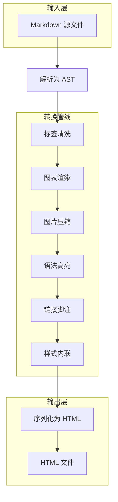
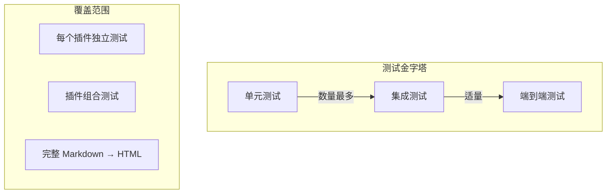
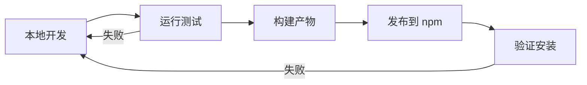

# 构建现代 CLI 工具：从零到发布

> 好的工具不需要说明书。它应该像呼吸一样自然。

在过去几年里，命令行工具经历了一场静悄悄的复兴。从 Rust 编写的 `ripgrep`、`fd`、`bat`，到 Node.js 生态的 `tsx`、`vitest`，开发者们重新发现了终端的魅力——**快速、可组合、可自动化**。

本文将以一个真实项目为例，分享构建现代 CLI 工具的完整流程。

---

## 架构总览

一个设计良好的 CLI 工具通常遵循**管线架构**（Pipeline Architecture）：输入经过一系列转换步骤，最终产生输出。每一步都是独立、可测试的。


这种架构的优势在于：

1. **单一职责** — 每个插件只做一件事
2. **可组合** — 插件可以自由增减和排序
3. **可测试** — 每个插件可以独立单元测试
4. **零开销** — 未使用的插件不产生性能消耗

## 技术选型

| 领域 | 选择 | 理由 |
|------|------|------|
| 语言 | TypeScript | 类型安全 + 生态丰富 |
| 构建 | Vite (Library Mode) | 速度快、配置少、Tree-shaking |
| 解析 | unified (remark + rehype) | 标准 AST、插件生态成熟 |
| 测试 | Vitest | 与 Vite 共享配置、速度极快 |
| 图表 | Mermaid + Playwright | 高质量 PNG 输出、可控主题 |

> 选型的核心原则：**能用标准的就不用定制的，能用成熟的就不用新奇的。**

## 插件系统设计

插件系统是整个架构的核心。我们采用 rehype 插件规范，每个插件是一个接收 AST 并原地修改的函数：

```typescript
import type { Plugin } from 'unified';
import type { Root, Element } from 'hast';
import { visit } from 'unist-util-visit';

interface PluginOptions {
    /** 是否启用严格模式 */
    strict?: boolean;
}

export const rehypeExample: Plugin<[PluginOptions?], Root> = (options = {}) => {
    const { strict = false } = options;

    return (tree: Root) => {
        visit(tree, 'element', (node: Element) => {
            // 遍历所有元素节点
            if (node.tagName === 'div') {
                // 将 div 替换为 section（微信兼容）
                node.tagName = 'section';
            }

            if (strict && node.tagName === 'script') {
                // 严格模式下移除脚本标签
                return 'remove';
            }
        });
    };
};
```

### 插件执行顺序

插件的执行顺序至关重要。以下是一个典型的处理管线：



注意几个关键的顺序约束：

- **图表渲染**必须在**图片压缩**之前 — 因为图表渲染会生成新的图片节点
- **语法高亮**必须在**样式内联**之前 — 因为高亮会添加 CSS 类名，样式内联会将其转为内联样式
- **标签清洗**必须在所有步骤之前 — 确保后续插件处理的是安全的 AST

## 图片处理策略

微信公众号编辑器对图片有严格限制：**不支持外部 URL**，所有图片必须以 base64 内嵌。同时单张图片不得超过 **2MB**。

我们的压缩策略采用**渐进式降级**：

```typescript
async function compressToDataUri(
    buffer: Buffer,
    mime: string,
    maxSize: number,
): Promise<string> {
    // 1. 先尝试 PNG 无损压缩
    let result = await sharp(buffer)
        .png({ compressionLevel: 6 })
        .toBuffer();

    if (result.length <= maxSize) {
        return `data:image/png;base64,${result.toString('base64')}`;
    }

    // 2. 逐步缩小尺寸（每次 80%）
    let width = (await sharp(buffer).metadata()).width!;
    while (width >= 100) {
        width = Math.floor(width * 0.8);
        result = await sharp(buffer)
            .resize({ width, withoutEnlargement: true })
            .png({ compressionLevel: 6 })
            .toBuffer();
        if (result.length <= maxSize) return toDataUri(result, 'png');
    }

    // 3. 最终降级为 JPEG
    for (const quality of [85, 70, 50]) {
        result = await sharp(buffer)
            .flatten({ background: '#ffffff' })
            .jpeg({ quality })
            .toBuffer();
        if (result.length <= maxSize) return toDataUri(result, 'jpeg');
    }

    throw new Error('图片压缩失败：超过 2MB 限制');
}
```

这个策略保证了：

- **优先无损** — PNG 格式不丢失画质
- **渐进降级** — 先缩尺寸，再降格式
- **兜底方案** — JPEG 能处理绝大多数情况

## 测试策略

好的测试应该像文档一样清晰。我们采用**三层测试金字塔**：



### 单元测试示例

```typescript
import { describe, it, expect } from 'vitest';
import { rehypeSanitizeTags } from '../src/plugins/index.ts';
import { processWithPlugin } from './helpers.ts';

describe('rehypeSanitizeTags', () => {
    it('should convert div to section', async () => {
        const html = await processWithPlugin(
            '<div>content</div>',
            rehypeSanitizeTags,
        );
        expect(html).toContain('<section>');
        expect(html).not.toContain('<div>');
    });

    it('should remove script tags', async () => {
        const html = await processWithPlugin(
            '<script>alert("xss")</script>',
            rehypeSanitizeTags,
        );
        expect(html).not.toContain('<script>');
        expect(html).not.toContain('alert');
    });

    it('should preserve safe attributes', async () => {
        const html = await processWithPlugin(
            '<a href="https://example.com">link</a>',
            rehypeSanitizeTags,
        );
        expect(html).toContain('href="https://example.com"');
    });
});
```

### 运行测试

```bash
# 运行所有测试
pnpm test

# 运行单个测试文件
pnpm test test/plugins/rehype-sanitize.test.ts

# 监听模式
pnpm test --watch

# 覆盖率报告
pnpm test --coverage
```

## 性能优化

### 异步并发

图片压缩是 I/O 密集型操作，天然适合并发处理：

```typescript
// ❌ 串行处理 — 慢
for (const task of tasks) {
    await compressImage(task);
}

// ✅ 并发处理 — 快
await Promise.all(
    tasks.map(task => compressImage(task)),
);
```

### 零开销抽象

每个插件在处理前先检测是否有需要处理的内容。如果没有，立即返回，不产生任何开销：

```typescript
return async (tree: Root) => {
    const tasks = collectTargetNodes(tree);
    if (tasks.length === 0) return; // 零开销快速路径

    // 只在有工作要做时才初始化资源
    const browser = await chromium.launch();
    try {
        // ... 处理逻辑
    } finally {
        await browser.close();
    }
};
```

## 发布流程



发布前的检查清单：

- [x] 所有测试通过
- [x] TypeScript 类型检查通过
- [x] 构建产物体积合理
- [ ] `README` 版本号已更新
- [ ] `CHANGELOG` 已补充

## 总结

构建一个好的 CLI 工具，关键不在于使用多少花哨的技术，而在于：

1. **架构清晰** — 管线模式让每个步骤独立、可测试
2. **渐进式** — 从核心功能开始，逐步添加插件
3. **零开销** — 未使用的功能不应该产生性能消耗
4. **可靠** — 完善的测试和错误处理

最后，记住 Unix 哲学：

> Do one thing and do it well.

**做好一件事。** 这就是好工具的全部秘密。

---

*本文使用 mdpress 编写并渲染，所有图表均由 Mermaid + Playwright 实时渲染。*
