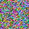
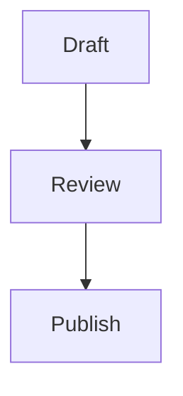

# X Articles 粘贴兼容性全量测试（H1 会映射为正文 H2）

## 1. 基础文本与行内样式

这是一段正文，包含 **粗体**、*斜体*、***粗斜体***、~~删除线~~、`inline code`、以及普通文本。

也测试一些特殊字符：`< > & " '`，以及 emoji：🚀 ✅ ✨。

## 2. 链接能力（X 编辑器应保留）

- 外部链接：[OpenAI](https://openai.com)
- 协议相对链接：[CDN Link](//cdn.example.com/lib.js)
- 邮件链接：[联系我](mailto:editor@example.com)
- 电话链接：[拨打电话](tel:+123456789)
- 锚点链接：[跳到列表](#section-lists)

> 引用块：链接在引用中也应保留，例如 [Docs](https://developers.x.com)。

## 3. 列表（含嵌套） {#section-lists}

- 一级无序项 A
- 一级无序项 B
  - 二级无序项 B.1
  - 二级无序项 B.2（含 [链接](https://example.org)）
- 一级无序项 C

1. 一级有序项 1
2. 一级有序项 2
   1. 二级有序项 2.1
   2. 二级有序项 2.2
3. 一级有序项 3

### 任务列表（通常会被降级为普通列表文本）

- [x] 已完成任务
- [ ] 待办任务

---

## 4. 图片（X 不支持图片，需转占位文本）

下面三张图用于验证“图片 => 占位文本”策略：





## 5. 表格（X 通常不支持，预期降级为纯文本）

| 特性 | 预期行为 | 说明 |
|---|---|---|
| img | 不保留 | 转占位文本 |
| table | 不保留表格结构 | 仅保留文本 |
| pre/code | 不保留代码块结构 | 仅保留文本 |

## 6. 代码块（X 通常吞掉结构）

```ts
interface User {
  id: string;
  name: string;
  tags: string[];
}

const user: User = {
  id: 'u_001',
  name: 'Alice',
  tags: ['writer', 'editor'],
};

console.log(user);
```

```bash
pnpm build
pnpm test
mdpress -i test/fixtures/x-article-showcase.md -o test/fixtures/x-article-showcase.html --target x --copy
```

## 7. Mermaid（X 不支持图像粘贴，预期转占位）



## 8. 原生 HTML（应被剥离/降级）

<div style="color:red; position:fixed; font-family: fantasy;">
  这是 div + style + span 的原生 HTML：
  <span data-test="1">Inner span text</span>
</div>

<script>alert('xss-should-never-remain');</script>

<iframe src="https://example.com"></iframe>

## 9. 总结

如果转换正确，X 模式输出应只保留最小语义化子集（标题/段落/列表/引用/链接/强调），并把图片替换成可读占位文本。
